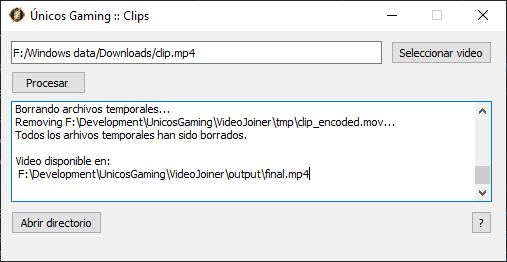

# UG Clips

This application add and intro and an outro to a video using [ffmpeg](https://github.com/FFmpeg/FFmpeg)



**NOTE**: The videos used for the intro and outro are not available in this repository.

## Run
```
python3 VideoJoiner.py
```

## Create the installer
```
pyinstaller VideoJoiner.spec
```
